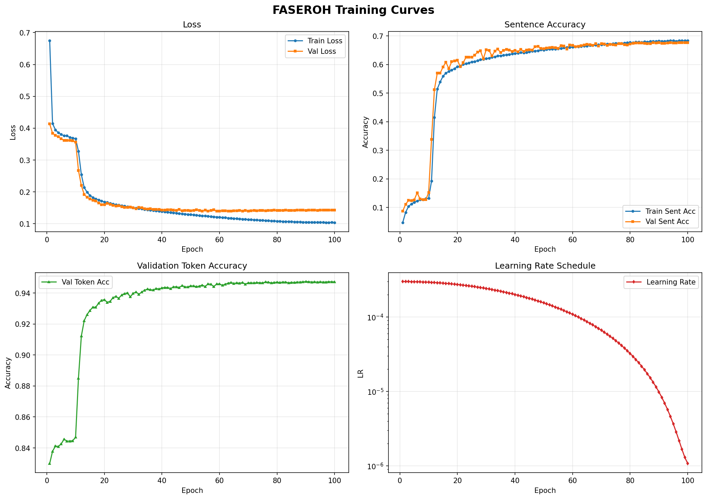

# FASEROH — Fast Accurate Symbolic Empirical Representation Of Histograms

A proof-of-concept seq2seq neural network that reads a normalised histogram and outputs a symbolic mathematical expression (in prefix notation) representing the underlying probability density function (PDF).

## Problem Statement

In high-energy physics and other scientific domains, experimental data is often represented as histograms — binned counts of observed events. Physicists typically need to determine the analytical form of the underlying probability distribution that generated the data. This process, known as **symbolic regression**, is traditionally done manually or with computationally expensive search methods.

FASEROH tackles this problem by training a neural network to directly map an empirical histogram to a symbolic mathematical expression. Given a histogram as input, the model autoregressively generates a prefix-notation expression representing the PDF, effectively performing **instant symbolic regression** in a single forward pass.

### Key Challenges

- **Variable-length outputs**: Different PDFs require expressions of different lengths and complexities
- **Continuous constants**: Symbolic expressions contain floating-point coefficients that cannot be captured by a fixed discrete vocabulary alone
- **Structural validity**: Generated expressions must be syntactically valid (correct operator arities) and mathematically evaluable (no division by zero, log of negatives, etc.)
- **Noise robustness**: Real histograms contain statistical noise from finite sampling — the model must look past noise to recover the true functional form

## Setup

### Prerequisites

- Python 3.13+
- pip

### Installation

```bash
# Clone the repository
git clone https://github.com/pyther-hub/ml4sci-faseroh-POC.git
cd faseroh-poc

# Create and activate a virtual environment
python -m venv .venv
source .venv/bin/activate

# Install dependencies
pip install torch numpy scipy sympy matplotlib
```

### Running Training

All configuration is controlled by the `FASeROHConfig` dataclass in `main.py`. You can modify hyperparameters there or override them interactively at runtime.

```bash
# Activate the virtual environment
source .venv/bin/activate

# Run training + evaluation
python main.py
```

Available datasets (under `data/`):
- `dataset_demo_1k.json` — 1,000 samples (quick experiments)
- `dataset_demo_10k.json` — 10,000 samples (default)
- `dataset_demo_100k.json` — 100,000 samples (full training)

Change `DATASET_JSON_PATH` at the top of `main.py` to switch datasets. Checkpoints are saved to `checkpoints/best_model.pt` whenever validation loss improves.

## Architecture

FASEROH uses an asymmetric encoder-decoder transformer architecture:

```
Histogram (K bins) → Encoder → Latent Representation → Decoder → Prefix Expression Tokens
```

- **Encoder**: Linear projection → Conv1d layers → Transformer encoder → cross-attention pooling into a fixed-size latent `(B, n_latent, d_model)`
- **Decoder**: Causal transformer decoder with dual output heads:
  - **Symbol head** — predicts the next token from a fixed vocabulary (~35 tokens: operators, variables, integers, constant-exponent markers)
  - **Mantissa head** — regresses the floating-point mantissa for constant tokens

Floating-point constants are encoded in scientific notation: a `C{ce}` token selects the exponent (10^ce, where ce ranges from -4 to 4), and the mantissa head predicts the significand. This keeps the vocabulary small while supporting arbitrary magnitudes.

### Loss Function

```
Total Loss = CrossEntropy(tokens) + λ * MSE(mantissas at C-token positions)
```

The weight λ warms up linearly from 0 over the first few epochs, letting the model learn expression structure before refining numeric accuracy.

### Default Hyperparameters

| Parameter | Value |
|---|---|
| `d_model` | 360 |
| `n_heads` | 8 |
| `n_enc_layers` | 4 |
| `n_dec_layers` | 6 |
| `n_latent` | 32 |
| `batch_size` | 32 |
| `learning_rate` | 1e-4 |
| `epochs` | 50 |

## Experiment & Results

### Baseline Training (10k dataset, 100 epochs)

The model was trained on `dataset_demo_10k.json` with the default configuration. The training curves below show convergence across key metrics:



**Observations:**
- **Loss** — Both training and validation loss converge rapidly in the first ~20 epochs, stabilizing around 0.1
- **Sentence Accuracy** — Exact-match accuracy reaches ~70% on validation, indicating the model recovers the correct symbolic expression for the majority of test cases
- **Token Accuracy** — Validation token accuracy plateaus at ~95%, showing strong per-token prediction even when full sequences don't match exactly
- **Learning Rate** — Cosine decay schedule from 1e-4, providing smooth convergence

### Evaluation Metrics

The model is evaluated on multiple complementary metrics:

| Metric | What it measures |
|---|---|
| **R²** | How well the predicted expression fits the histogram numerically |
| **Sentence Accuracy** | Fraction of predictions that exactly match the ground-truth token sequence |
| **Prefix Validity** | Fraction of predictions that are syntactically valid prefix expressions |
| **Function Validity** | Fraction of predictions that are mathematically evaluable over [0, 1] |
| **Goodness of Fit (χ²/ndf)** | Statistical agreement between predicted and observed distributions (values near 1.0 are ideal) |

## Notebooks

### `faseroh-dataset-generation-poc.ipynb`

This notebook demonstrates the **dataset generation pipeline** — how synthetic (histogram, expression) training pairs are created. It walks through:

- Random symbolic function synthesis using compositional rules (polynomials, exponentials, trigonometric functions, and combinations)
- Normalization to valid PDFs over [0, 1]
- Poisson-sampled histogram generation that mimics real experimental noise
- Conversion of expressions to prefix notation and the constant-encoding scheme

### `faseroh-model-training-poc.ipynb`

This notebook provides an **interactive training and inference walkthrough**. It covers:

- Loading a pre-generated dataset and configuring the model
- Running the training loop with live metric tracking
- Evaluating the trained model on held-out test data
- Running inference on custom histograms to see the model predict symbolic expressions

## Project Structure

```
faseroh-poc/
├── main.py                  # Entry point, configuration, training loop
├── model.py                 # FASeROH encoder-decoder architecture
├── train.py                 # Training and evaluation functions
├── dataset.py               # Dataset class and data loading utilities
├── dataset_generation.py    # Symbolic function and histogram generation
├── tokenizer.py             # Vocabulary definition and token utilities
├── inference.py             # Autoregressive decoding and inference
├── metrics.py               # Evaluation metrics (R², accuracy, χ²/ndf)
├── data/
│   ├── dataset_demo_1k.json
│   ├── dataset_demo_10k.json
│   └── dataset_demo_100k.json
├── faseroh-dataset-generation-poc.ipynb
├── faseroh-model-training-poc.ipynb
└── faseroh-poc-training-baseline.png
```

## License

This project is a proof-of-concept developed as part of GSoC research.
